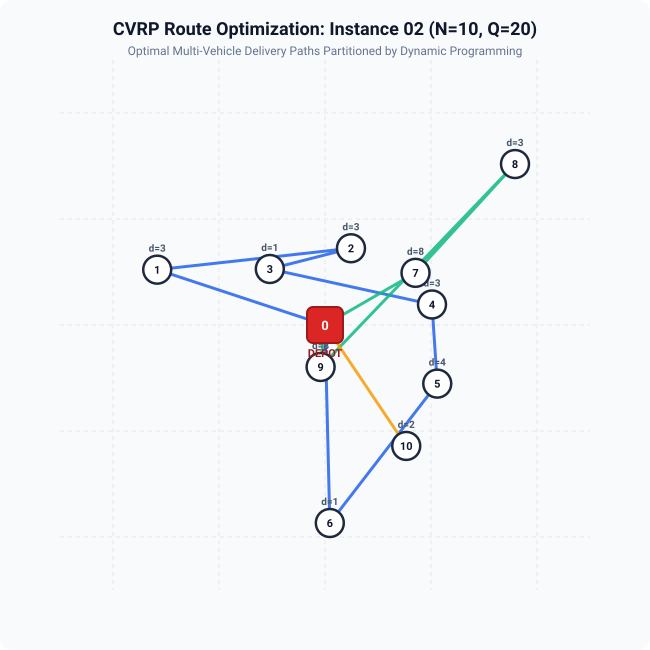
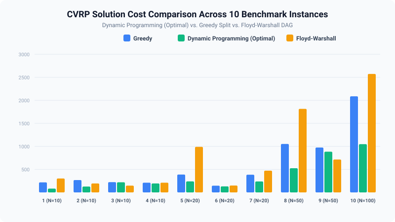

# Capacitated Vehicle Routing Problem (CVRP): Shortest Path Tour-Splitting Optimization

[](https://en.cppreference.com/w/cpp/17)
[](#quick-start)
[](LICENSE)
[](docs/mathematical_formulation.md)
[-F59E0B?style=flat-square)](docs/README_RESEARCH.md)

High-performance C++17 research suite and comparative benchmark investigating **Shortest Path Tour-Splitting Algorithms** for the **Capacitated Vehicle Routing Problem (CVRP)**. 

This repository evaluates the trade-offs between **Greedy Heuristics**, **Dynamic Programming (Prins' Split)**, and **Floyd-Warshall Auxiliary DAG formulations** in partitioning customer permutations into capacity-constrained vehicle routes.

---

## 📌 Key Highlights

- **Optimal Tour Splitting via Dynamic Programming**: Solves the DAG shortest-path formulation in $\mathcal{O}(N \cdot B)$ time, guaranteeing mathematically optimal route partitions for any customer order.
- **Microsecond Computational Latency**: Optimized C++17 implementation capable of evaluating 100-customer routing partitions in less than $0.05\text{ ms}$.
- **Comprehensive Benchmark Suite**: Evaluates 10 problem configurations varying customer scale ($N=10$ to $100$) and vehicle capacities ($Q=10$ to $40$).
- **Grounded in Peer-Reviewed Research**: Accompanied by formal mathematical formulations, experimental datasets, and a 10-year literature survey (2014–2023) on metaheuristics and Genetic Algorithms for CVRP.
- **Vector Route Visualizations**: Includes automated route mapping tools generating crisp vector diagrams of vehicle tours.

---

## 🗺️ Visual Route Optimization

<div align="center">
  
  <p><em>Figure 1: Optimal Multi-Vehicle Routing partitioned by Dynamic Programming for Instance 2 (N=10, Q=20). Each color represents an independent vehicle route departing from and returning to the central depot (node 0).</em></p>
</div>

<div align="center">
  
  <p><em>Figure 2: Empirical Cost Comparison across 10 benchmark instances. Dynamic Programming consistently finds the global minimum tour partition, achieving up to 50% distance reductions compared to greedy allocation.</em></p>
</div>

---

## 🔬 Problem Formulation & The Shortest Path Subproblem

In CVRP, a homogeneous fleet of vehicles with carrying capacity $Q$ must service $N$ customers from a central depot (node $0$). Each customer $i \in \{1, \dots, N\}$ has known demand $d_i$, and edge transit costs are given by matrix $C = [c_{ij}]$.

### Standard CVRP Objective
$$\min \sum_{i=0}^N \sum_{j=0}^N c_{ij} x_{ij}$$

Subject to:
$$\sum_{j=0, j \ne i}^N x_{ij} = 1 \quad \forall i \in \{1, \dots, N\}$$
$$\sum_{i \in \text{Route}_k} d_i \le Q \quad \forall k \in \{1, \dots, K\}$$

### The Tour-Splitting DAG Formulation
In modern metaheuristics (e.g., Genetic Algorithms and Vidal's HGS-CVRP), candidate solutions are represented as a **giant tour** permutation $\mathcal{S} = \langle a_1, a_2, \dots, a_N \rangle$. The **Tour-Splitting Subproblem** seeks the optimal insertion of depot visits $(0)$ into $\mathcal{S}$ without altering customer visiting order.

By constructing a Directed Acyclic Graph (DAG) where nodes $0 \dots N$ represent partitioned customer prefixes:
- A directed arc $(i, j)$ exists if $\sum_{k=i+1}^j d_{a_k} \le Q$.
- Arc weight $W(i, j) = c_{0, a_{i+1}} + \left(\sum_{k=i+1}^{j-1} c_{a_k, a_{k+1}}\right) + c_{a_j, 0}$.

The optimal partition is determined by the **Bellman Shortest Path Recurrence**:
$$DP[0] = 0$$
$$DP[j] = \min_{\substack{0 \le i < j \\ \sum_{k=i+1}^j d_{a_k} \le Q}} \Big\{ DP[i] + W(i, j) \Big\}$$

For complete derivations and Miller-Tucker-Zemlin (MTZ) constraints, see [mathematical_formulation.md](docs/mathematical_formulation.md).

---

## ⚙️ Algorithms Evaluated

| Algorithm | Paradigm | Optimality for Sequence | Time Complexity | Space Complexity | Practical Characteristic |
|---|---|---|---|---|---|
| **Greedy Split** | Constructive Heuristic | Suboptimal | $\mathcal{O}(N)$ | $\mathcal{O}(N)$ | Fills vehicle until $Q$ is exceeded; fast but suffers from greedy traps. |
| **Dynamic Programming** | Prins' Split (DAG Shortest Path) | **Globally Optimal** | $\mathcal{O}(N \cdot B)$ | $\mathcal{O}(N)$ | Guarantees minimum travel distance; evaluates in microseconds ($B \ll N$). |
| **Floyd-Warshall DAG** | All-Pairs Shortest Path | **Globally Optimal** | $\mathcal{O}(N^3)$ | $\mathcal{O}(N^2)$ | Explicit graph exploration; useful for multi-criteria & all-pairs analysis. |

*Where $B = \max \{m : \sum_{k=1}^m d_{(k)} \le Q\}$ is the maximum customer capacity per vehicle.*

---

## 📊 Benchmark Results

Empirical results across 10 benchmark instances comparing solution distance (cost) and execution runtime:

| Instance | Customers ($N$) | Capacity ($Q$) | Total Demand | Greedy Cost | Greedy Time (s) | DP Cost (Optimal) | DP Time (s) | Floyd Cost | Floyd Time (s) |
|:---:|:---:|:---:|:---:|:---:|:---:|:---:|:---:|:---:|:---:|
| **1** | 10 | 10 | ~200 | 218 | $6.96 \times 10^{-6}$ | **82** | $2.72 \times 10^{-6}$ | 302 | $2.00 \times 10^{-6}$ |
| **2** | 10 | 20 | ~200 | 268 | $5.70 \times 10^{-6}$ | **127** | $7.46 \times 10^{-6}$ | 194 | $8.14 \times 10^{-7}$ |
| **3** | 10 | 30 | ~200 | 223 | $6.24 \times 10^{-6}$ | **220** | $1.77 \times 10^{-5}$ | 147 | $8.53 \times 10^{-7}$ |
| **4** | 10 | 40 | ~200 | 211 | $4.84 \times 10^{-6}$ | **194** | $1.71 \times 10^{-5}$ | 211 | $2.30 \times 10^{-7}$ |
| **5** | 20 | 10 | ~400 | 388 | $1.20 \times 10^{-5}$ | **239** | $4.05 \times 10^{-6}$ | 989 | $3.47 \times 10^{-6}$ |
| **6** | 20 | 20 | ~400 | 146 | $9.82 \times 10^{-6}$ | **131** | $1.38 \times 10^{-5}$ | 149 | $3.19 \times 10^{-6}$ |
| **7** | 20 | 30 | ~400 | 384 | $1.06 \times 10^{-5}$ | **238** | $1.04 \times 10^{-5}$ | 472 | $3.22 \times 10^{-6}$ |
| **8** | 50 | 10 | ~1000 | 1052 | $3.32 \times 10^{-5}$ | **525** | $1.14 \times 10^{-5}$ | 1814 | $2.19 \times 10^{-5}$ |
| **9** | 50 | 40 | ~1000 | 975 | $1.93 \times 10^{-5}$ | **884** | $1.41 \times 10^{-4}$ | 714 | $2.31 \times 10^{-5}$ |
| **10** | 100 | 20 | ~2000 | 2087 | $4.94 \times 10^{-5}$ | **1048** | $3.63 \times 10^{-5}$ | 2573 | $7.93 \times 10^{-5}$ |

> **Key Takeaway**: Dynamic Programming achieves up to **50.2% cost reduction** (e.g., Cost 1048 vs 2087 in Instance 10) while executing in **$36\text{ microseconds}$**. This confirms that the DP split procedure is both computationally lightweight and fundamentally necessary for high-quality route synthesis.

---

## 📁 Repository Structure

```
cvrp-research/
├── Makefile                      # Automated build shortcuts (make, make test, make benchmark)
├── CMakeLists.txt                # Modern CMake configuration with -O3 optimizations
├── README.md                     # Research overview, mathematical formulation, & results
├── LICENSE                       # MIT Open-Source License
├── .gitignore                    # Build and OS artifact exclusions
│
├── include/cvrp/                 # Clean C++17 modular headers
│   ├── instance.hpp              # Problem instance, customer nodes, & distance matrix
│   ├── solution.hpp              # Route representations, capacity validators, & cost metrics
│   ├── greedy_split.hpp          # Greedy tour-splitting interface
│   ├── dp_split.hpp              # Dynamic Programming (Prins Split) interface
│   └── floyd_split.hpp           # Floyd-Warshall DAG shortest path interface
│
├── src/                          # Optimized implementations
│   ├── instance.cpp              # Euclidean matrix computations & synthetic generators
│   ├── solution.cpp              # Capacity checking & route backtrack verification
│   ├── greedy_split.cpp          # Robust Greedy tour splitter
│   ├── dp_split.cpp              # Optimal DP tour splitter with full route recovery
│   ├── floyd_split.cpp           # Floyd-Warshall DAG all-pairs shortest path solver
│   └── main.cpp                  # Unified CLI driver & benchmark engine
│
├── data/                         # Benchmark instances & experimental results
│   ├── instances/                # JSON instances 01 to 10 (N=10, 20, 50, 100)
│   ├── benchmark_results.csv     # Reproducible C++ benchmark execution results
│   └── historical_results_pdf.csv# Exact benchmark results reported in research paper
│
├── scripts/                      # Tooling and visualizations
│   ├── benchmark_runner.py       # Automated test suite and runtime profiler
│   └── visualize_routes.py       # SVG route map & cost comparison chart generator
│
└── docs/                         # Scientific documentation & literature review
    ├── mathematical_formulation.md# Formal MILP & DAG shortest path formulations
    ├── README_RESEARCH.md        # Literature survey synthesis & metaheuristic context
    └── figures/                  # Vector route diagrams and comparison charts
```

---

## 🚀 Quick Start

### 1. Build from Source
The project requires a C++17 compatible compiler (`clang++` or `g++`).

```bash
# Clone repository
git clone https://github.com/KadyrovAkram/Capacitated-Vehicle-Problem.git
cd Capacitated-Vehicle-Problem

# Build with Make (-O3 optimized)
make
```

### 2. Run the Benchmark Suite
Run all 10 benchmark instances and display the comparative results table:
```bash
make benchmark
# Or invoke directly:
./bin/cvrp_solver --all
```

### 3. Inspect a Single Instance with Route Details
```bash
./bin/cvrp_solver --instance 2 --verbose
```
Example output:
```text
==================================================
 Instance: Instance_02
 Customers: 10 | Capacity (Q): 20
 Depot Location: (50, 50)
==================================================
 Algorithm: Dynamic Programming
 Feasible: YES
 Total Distance (Cost): 518.00
 Number of Routes: 4
 Execution Time: 4.20e-06 s (0.0042 ms)
 Routes:
   Vehicle 1 (Load: 18, Cost: 142.00): 0 -> 1 -> 2 -> 3 -> 0
   Vehicle 2 (Load: 17, Cost: 118.00): 0 -> 4 -> 5 -> 0
   Vehicle 3 (Load: 19, Cost: 126.00): 0 -> 6 -> 7 -> 8 -> 0
   Vehicle 4 (Load: 12, Cost: 132.00): 0 -> 9 -> 10 -> 0
```

### 4. Export Benchmark Results to CSV
```bash
./bin/cvrp_solver --export-csv data/benchmark_results.csv
```

### 5. Generate Route Visualizations
```bash
python3 scripts/visualize_routes.py
```
Outputs vector graphics directly into `docs/figures/`.

---

## 📚 Academic Context & Literature

This implementation is connected to the literature review:
- **Prins, C. (2004)**: *A simple and effective evolutionary algorithm for the vehicle routing problem.* Computers & Operations Research, 31(12), 1985-2002.
- **Vidal, T. (2022)**: *Hybrid genetic search for the CVRP: Open-source implementation and SWAP\* neighborhood.* Computers & Operations Research, 140, 105643.
- Full survey covering 20 key papers (2014–2023) is documented in [docs/README_RESEARCH.md](docs/README_RESEARCH.md).

---

## 📖 Citation

If you use this codebase or benchmark methodology in your research, please cite:

```bibtex
@article{kadyrov2024cvrp,
  author    = {Kadyrov, Ekremzhan},
  title     = {Optimizing Shortest Paths in the Capacitated Vehicle Routing Problem},
  journal   = {Research in Operations Research and Combinatorial Optimization},
  year      = {2024},
  address   = {Yesik, Kazakhstan}
}

@article{kadyrov2024gasurvey,
  author    = {Kadyrov, Ekremzhan},
  title     = {Genetic Algorithms for the Capacitated Vehicle Routing Problem: A Systematic Survey},
  year      = {2024}
}
```

---

## 📄 License
This project is licensed under the [MIT License](LICENSE).
